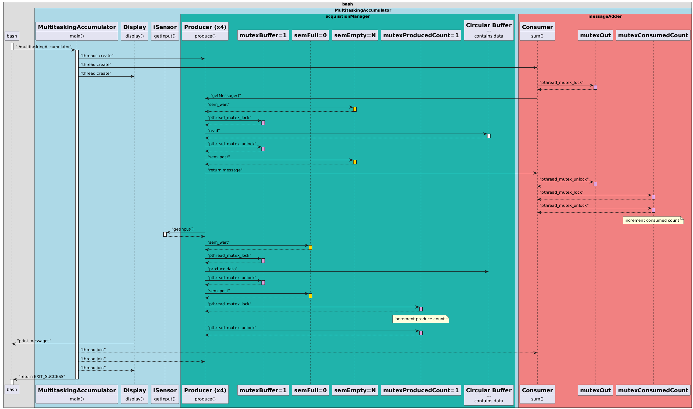

# Practical Work

This is the Multitasking Training Practical Practical Course.

Students :
FERDINAND Justin
ARSON Gautier

All instructions are in the pdf file.

## Build

```bash
make posix & make atomic & make testandset
```

## run

```bash
./multitaskingAccumulatorPosix
./multitaskingAccumulatorAtomic
./multitaskingAccumulatorTestAndSet
```

## Sequence diagram


