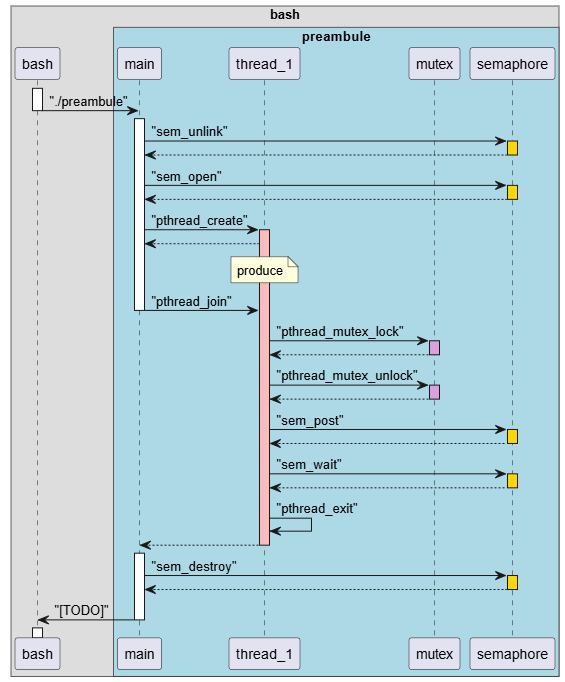

## Préambule

### Question 2

Nom du thread : thread_1

### Question 3

Nom du sémaphore : semaphore

### Question 4

Nom du mutex : mutex

### Question 5

Le thread est créé à la ligne 44 par :

pthread_create(&thread_1,NULL, produce, NULL);

### Question 6

Le point d'entrée du thread est la méthode :

*produce(void *params)

### Question 7

L'attente de la fin du thread se fait par la ligne :

pthread_join(thread_1, NULL);

### Question 8

Le thread par défaut du processus courant est celui décrit par la fonction main().

### Question 9

Demander au prof

### Question 10



### Question 11

A compléter

## Partie 1 - MultitaskingAccumulator

## Question 1


## Question 2

## Implémentation

### Question 7 

L'impémentation de la conception est disponible dans le fichier archive de notre rendu. 

Voici un résultat d'exécution :

```bash
Get message for input 0 
[msg]....Sum done...
[OK      ] Checksum validated
[acquisitionManager] Producer 0 produced message 4
Get message for input 2 
[OK      ] Checksum validated
[acquisitionManager] Producer 2 produced message 3
Get message for input 1 
[OK      ] Checksum validated
[acquisitionManager] Producer 1 produced message 3
[msg]....Sum done...
Get message for input 1 
Get message for input 3 
[OK      ] Checksum validated
[acquisitionManager] Producer 1 produced message 4
[OK      ] Checksum validated
[acquisitionManager] Producer 3 produced message 4
[acquisitionManager] 8264 termination
[msg]....Sum done...
[acquisitionManager] 8267 termination
Get message for input 2 
[OK      ] Checksum validated
[acquisitionManager] Producer 2 produced message 4
[acquisitionManager] 8265 termination
[displayManager] 8269 termination
[msg]....Sum done...
[msg]....Sum done...
[acquisitionManager] 8266 termination
[acquisitionManager]Semaphore cleaned
[msg]....Sum done...
[msg]....Sum done...
[msg]....Sum done...
[msg]....Sum done...
[msg]....Sum done...
[msg]....Sum done...
[msg]....Sum done...
[msg]....Sum done...
[messageAdder] 8268 termination
[messageAdder] Sum thread joined
[multitaskingAccumulator]Threads terminated
```
## Partie 2 - ATOMIC

### Question 10Les processus POSIX ont l'avantage d'isoler l'espace mémoire. Si un processus plante, il n'affecte pas les autres, ce qui garantit un confinement des erreurs et donc une solution plus robuste que les tâches (threads). Cependant, l'utilisation de processus implique un surcoût pour le CPU (création et changement de contexte plus lourds). L'accès direct aux données partagées n'étant pas possible nativement (contrairement aux threads), l'utilisation de variables globales ne suffit pas. Il faudrait mettre en œuvre de la mémoire partagée POSIX (via shm_open/mmap) pour stocker le buffer et les mécanismes de synchronisation.

### Question 11

Une solution serait d'utiliser des variables atomic, dont l'atomicité est géré par le hardware (côté CPU) et non software (mutex).

### Question 12

static void incrementProducedCount(void)
{
	atomic_fetch_add(&producedCount, 1);
}

unsigned int getProducedCount(void)
{
	return atomic_load(&producedCount);
}

Get message for input 1
[OK      ] Checksum validated
[acquisitionManagerAtomic] Producer 1 produced message 3
Get message for input 0
[OK      ] Checksum validated
[acquisitionManagerAtomic] Producer 0 produced message 3
[msg]....Sum done...
Get message for input 2
[OK      ] Checksum validated

Proposez une deuxième solution pour que ces méthodes incrementProducerCount et getProducerCount en vous basant sur la méthode
atomic_compare_exchange_weak ?

### Question 13

Une autre solution pour protéger la variable atomique est d'utiliser une variable atomique comme drapeau d'accès (à la même manière d'un mutex). La méthode atomic_compare_exchange_weak utilise notre variable atomique pour vérifier si l'accès à la donnée est disponible. Tant que la variable atomique ne le permet pas, la méthode va échouer et rester en attente active.

### Question 14
```c
static void pCountLockTake(void) {
    int expected = 0;
  
    while (!atomic_compare_exchange_weak(&pCountLock, &expected, 1)) {
       expected = 0;
    }
}

static void pCountLockRelease(void) {
    atomic_store(&pCountLock, 0);
}

static void incrementProducedCount(void)
{
	pCountLockTake();
    producedCount++;
    pCountLockRelease();
}
```

### Question 15
POSIX avg time : 367.5 us
ATOMIC avg time : 148.1 us
A weak avg time : 405.2 us

Conclusion sur les mesures : On observe que l'implémentation MultitaskingAccumulatorAtomic est la plus performante et la plus stable (temps moyens très bas, autour de 148.1µs). L'implémentation TestA est moins efficace car l'attente active de la variable atomique consomme inutilement des cycles CPU tant que le verrou n'est pas libre. Enfin, l'implémentation POSIX est globalement plus lente et surtout plus irrégulière (fortes variations entre les exécutions).
Pour POSIX, on peut dire que les appels système sont la raison du surplus de coût dans le temps d'exécution.

### Question 16

Une approche basée sur le temps, et non basée par les évènements est une approche synchrone.

### Question 17


Le diagramme ci-dessus illustre une production de messages toutes les 100ms en méthode synchrone. Le pipeline producteur -> consommateur -> display est ainsi représenté.

La tâche producer s'exécute périodiquement sur chaque front d'horloge pour récupérer les donneurs du capteur.
La tâche consumer traite les données produites lors du cycle précédent et la tâche display finalise en affichant les résultats accumulés.

Ainsi, l'activation systématique du thread_producer à chaque front d'horloge garantit l'exigence 6. La double ligne rouge en bas du graphique représente le délai de bout en bout demandé par l'exigence 7.

### Question 18

Le jitter de sortie est garantit par l'introduction de contraintes temporelles de type before dans le modèle PsyC. Concrètement, cela se traduit par l'ajout de deadlines strictes (représentées par des lignes verticales hachurées sur le diagramme) pour la tâche d'affichage. Cela garantit que la sortie est toujours disponible avant la fin du cycle alloué, rendant le flux de sortie régulier et prédictible.
